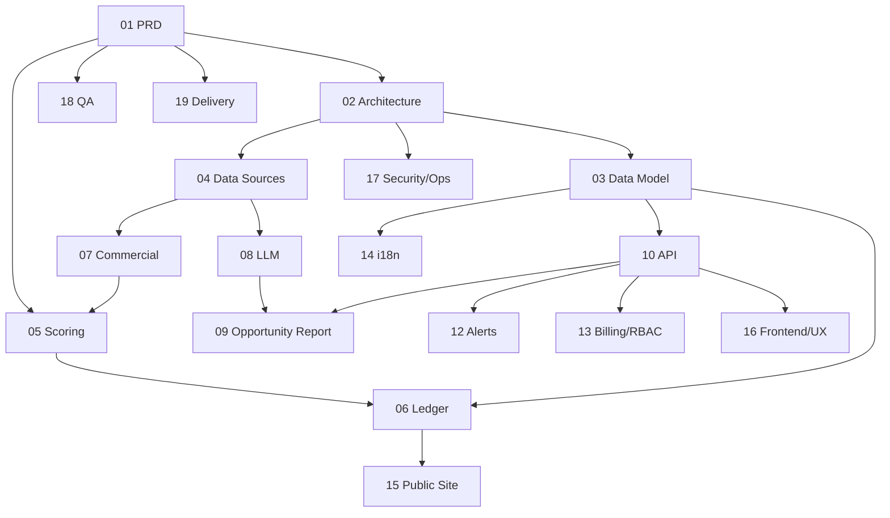

# 00 — 文档索引与工程约定

适用范围：`01-PRD.md` 之后的全部开发文档。
**冲突裁决顺序**：`01-PRD` > `05-SCORING-CONFIG-SPEC` > `03-DATA-MODEL` > 其余文档。全局枚举以本文 §4.3 为唯一定义，其他文档只引用、不重新定义。

---

## 1. 文档地图

| 编号 | 文档 | 回答的问题 | 主要读者 |
|------|------|-----------|----------|
| 01 | PRD | 做什么、为什么、怎么算成功 | 全员 |
| 02 | SYSTEM-ARCHITECTURE | 系统怎么组成、每日管线怎么跑 | 后端、架构 |
| 03 | DATA-MODEL | 表结构与不变量 | 后端 |
| 04 | DATA-SOURCE-REGISTER | 数据从哪来、多贵、合规吗、怎么采 | 后端、数据、法务 |
| 05 | SCORING-CONFIG-SPEC | 三轴 / Verdict / 生命周期如何确定性计算 | 后端、数据 |
| 06 | PREDICTION-LEDGER-SPEC | 预测账本、回测、战绩如何做到不可篡改 | 后端、数据 |
| 07 | COMMERCIAL-SIGNAL-SPEC | 商业信号怎么采、怎么分级、怎么不说谎 | 后端、数据 |
| 08 | LLM-PIPELINE-SPEC | LLM 用在哪、怎么约束、怎么评测 | 后端、ML |
| 09 | OPPORTUNITY-REPORT-SPEC | 机会研究报告的结构、生成、闭环与多格式导出 | 后端、产品 |
| 10 | API-SPEC | REST 接口契约 | 前后端 |
| 12 | ALERTS-SPEC | Watchlist、Kill criteria、通知投递 | 后端 |
| 13 | BILLING-RBAC | 套餐、配额、权限、滥用防护 | 后端、产品 |
| 14 | INTERNATIONALIZATION | 三概念分离、生成内容本地化 | 前后端 |
| 15 | PUBLIC-SITE-PUBLICATION-SPEC | 公开页、Track Record、发布流水线 | 前端、增长 |
| 16 | FRONTEND-UX-SPEC | 路由、页面、组件、状态 | 前端、设计 |
| 17 | SECURITY-PRIVACY-OPS | 安全、隐私、可观测性、运维 | 全员 |
| 18 | QA-TEST-STRATEGY | 测试分层、评测集、验收追溯 | 全员 |
| 19 | DELIVERY-PLAN | Epic、估算、里程碑、关键路径 | 项目负责人 |
| 20 | COMMERCIAL-RELEASE | 首发卖什么、不卖什么、页面与闭环 | 产品、全员 |
| 21 | DOCKER-VPS-DEPLOYMENT | 独立 VPS 与生产 Docker 部署指南 | 运维、全员 |
| 22 | EARLY-DISCOVERY-DEVELOPMENT-PLAN | 新实体与早期搜索机会开发计划 | 后端、数据 |
| 23 | COMPETITIVE-EVOLUTION-AND-EXECUTION-PLAN | 竞品对标演进与实施计划 (Sprint 1~4) | 产品、全员 |

## 2. 依赖关系

## 3. 按角色阅读顺序
- **后端 / 数据**：01 → 02 → 03 → 05 → 04 → 07 → 06 → 08 → 10
- **前端**：01 → 16 → 10 → 14 → 15
- **项目负责人**：01 → 20 → 19 → 18 → 17

---

## 4. 全局约定

### 4.1 标识符
格式：`{prefix}_{ULID}`。

| 前缀 | 对象 | 前缀 | 对象 |
|------|------|------|------|
| `usr` | 用户 | `vdt` | Verdict（账本行） |
| `opp` | Opportunity | `rpt` | 机会研究报告 |
| `ent` | Entity | `prj` | Project |
| `qry` | Query | `alr` | 告警规则 |
| `src` | 数据源 | `ntf` | 通知 |
| `run` | 采集 / 任务运行 | `kc` | Kill criteria |
| `snp` | 快照 | `llm` | LLM 运行 |
| `evd` | Evidence | `pgm` | 公开页 |

### 4.2 时间
- 所有时间戳为 UTC，`timestamptz`，ISO 8601。
- `obs_date`：UTC 日期，代表"当日批次"。账本与回放以 `obs_date` 为准。
- 展示层按用户时区转换；账本、API 内部不做转换。

### 4.3 枚举（唯一定义）
| 名称 | 取值 |
|------|------|
| `verdict` | `BUILD_NOW` `EARLY_BET` `WINDOW_CLOSING` `WATCH` `PASS` |
| `lifecycle` | `FORMING` `EARLY_WINDOW` `CONTESTED` `MATURE` `DEAD` |
| `band` | `HIGH` `MEDIUM` `LOW` `INSUFFICIENT` |
| `confidence` | `HIGH` `MEDIUM` `LOW` |
| `evidence_class` | `OBSERVED` `SELF_REPORTED` `THIRD_PARTY_ESTIMATE` `INFERRED` |
| `build_type` | 首发：`TOOL` `CONTENT_SITE` `PSEO_SITE` `DIRECTORY` `MICRO_SAAS`；Phase 2：`API_DEVTOOL` `MANAGED_SERVICE` |
| `monetization_route` | `ADS_AFFILIATE` `LEAD_GEN` `SAAS_SUBSCRIPTION` `DIRECTORY_MARKETPLACE` `API_DEVELOPER` |
| `route_grade` | `PRIMARY` `SECONDARY` `NOT_RECOMMENDED` |
| `execution_class` | `S` `M` `L` |
| `decision` | `GO` `PASS` |
| `time_budget` | `WEEKEND` `TWO_WEEKS` `ONE_MONTH` |
| `tier`（追踪层级） | `A`（每日 SERP）`B`（每周 SERP）`C`（仅 autocomplete） |
| `opportunity_status` | `CANDIDATE` `TRACKED` `ARCHIVED` |
| `commercial_stage` | `NONE` `INTENT_ONLY` `INFRA_PRESENT` `PRICED` `PAID_PERSISTENT` `REVENUE_EVIDENCED` |
| `validation_level` | `DIRECT` `CATEGORY` `ANALOG` |
| `intent` | `INFORMATIONAL` `COMMERCIAL` `TRANSACTIONAL` `NAVIGATIONAL` |
| `priority` | `P0` `P1` `P2` |

### 4.4 地域与语言
- `ui_locale`：`zh-CN` `en-US`
- `research_language`：BCP 47（首发验证 `en-US`）
- `market_country`：ISO 3166-1 alpha-2，大写（首发验证 `US`）
- 三者在所有表、API、日志中独立存在，禁止互相推导。

### 4.5 版本号
- `scoring_config_version`：`sc-{major}.{minor}.{patch}`
- `eval_spec_version`：`ev-{major}.{minor}`
- `schema_version`（机会报告等 JSON 结构）：`{major}.{minor}`
- REST：`/api/v1`。

---

## 5. 技术假设与 ADR

以下为默认假设，均可通过 ADR 推翻，但推翻前不得在各文档中悄悄改用其他方案。

| ADR | 决策 | 理由 | 状态 |
|-----|------|------|------|
| 001 | TypeScript 单仓（pnpm + Turborepo）；**Next.js App Router 融合部署**（见 011） | 2–3 人团队，降低上下文切换与运维面 | Accepted |
| 002 | PostgreSQL 为唯一事实源；对象存储保存原始载荷 | 事务一致、账本不变量可由 DB 强制 | Accepted |
| 003 | 队列与调度使用 pg-boss（Postgres）；pg-boss 实例通过 `DATABASE_DIRECT_URL` 直连或会话池以支持 LISTEN/NOTIFY，普通业务查询经 PgBouncer（transaction 模式）代理（见 012） | 首发不引入 Redis / Kafka | Accepted |
| 004 | 评分为纯函数包 `@app/scoring`，无 IO、无 LLM；核心中间计算使用定点整数（基点），禁止直接比较原生浮点 | 确定性与可重算（P7）；规避浮点求和顺序 / 库版本差异导致的跳档（见 013） | Accepted |
| 005 | Verdict 账本 append-only，DB 层强制；**S6 由单一 Worker 串行批量写入，禁止并发写 `verdicts`**（见 014） | 战绩可信度；哈希链要求严格前后依赖，无法并行化 | Accepted |
| 006 | SERP / autocomplete 走授权 API，直接抓取需书面豁免；商业信号抓取（`src_crawl`）采用两级管道，静态优先、动态渲染站点回退无头浏览器（见 04 §4.2） | 合规与稳定性；现代 SPA / Stripe Pricing Table 站点静态抓取拿不到价格 | Proposed（见 04、§7 决策） |
| 007 | 计费使用 Merchant of Record | 全球税务合规，小团队无力自建 | Proposed |
| 008 | 移除非核心的 AI 编码执行引擎与 MCP 服务，系统聚焦于搜索机会情报、商业验资与决策分析报告导出 | 避免与 Cursor/Claude Code 等成熟工具生态劣势竞争；降低 60% LLM 成本与状态机复杂度 | Superseded / Cancelled |
| 009 | Web：Next.js（App Router）+ Tailwind；REST 路由以 Route Handler 形式承载于 `apps/web`（见 011），不再单列 `apps/api` 为独立部署单元 | 同时承载应用与公开站 SSR / ISR；避免拆分服务带来的跨域鉴权与二次序列化开销 | Accepted（修订，见 011） |
| 010 | LLM 仅用于分类、抽取、文本生成，输出必须 schema 校验并引用 evidence；硬数字（价格、天数、计数等）由确定性占位符替换渲染，不做字面正则比对校验（见 08 §6.3） | 可审计；避免"约12个"类自然语言表述被误杀 | Accepted（修订） |
| 011 | 部署拓扑融合：`apps/web`（Next.js，承载页面渲染 + `app/api/v1/*` Route Handler 对外提供 REST API）+ `apps/worker`（批处理与告警投递），取消独立 `apps/api` 部署单元 | 2–3 人团队运维面最小化；RSC/Server Actions 可直接调用 `packages/services`，避免内部 HTTP 跳步与二次序列化 | Accepted |
| 012 | 生产数据库连接分流：业务查询经 PgBouncer（transaction pooling 模式）；`pg-boss` 队列与会话级锁（如 S6 advisory lock）使用独立直连 `DATABASE_DIRECT_URL`；`opportunity_cards` 等 S8 读模型采用双缓冲表切换（写入影子表 + 原子 rename / 视图切换），避免长事务锁表影响在线查询 | 批处理与在线查询隔离，同时保证 pg-boss 的 LISTEN/NOTIFY 不被 transaction pooling 切断 | Accepted |
| 013 | 高频事实表（`evidence` `llm_runs` `cost_ledger` `raw_payloads` `commercial_snapshots`）主键存储为原生 `uuid`（应用层生成 UUIDv7 以保证写入局部性），对外 API 仍展示为带前缀字符串；其余业务实体表维持 `text` 前缀 ULID | 千万级行表的 B-tree 索引体积与内存占用；保留低频表的人类可读性 | Accepted（见 03 §1） |
| 014 | `verdicts` 账本写入（S6）在单个 Worker 进程内，对当日全部机会按 `opportunity_id` 排序后于内存中串行计算哈希链，最后一次批量 `COPY`/批量 `INSERT` 提交；禁止多 Worker 并发写该表 | 哈希链定义要求严格前后依赖；串行内存计算 + 批量提交在追踪池规模（≤ 2,000）下可在数百毫秒内完成，无需并行化 | Accepted |
| 015 | 用户认证采用 Auth.js (NextAuth v5) 自建，会话与凭据存储于 PostgreSQL 专用适配表（`accounts`, `sessions`, `verification_tokens`） | 商业数据私密性；避免外部托管 Auth 服务（Clerk/Supabase）带来的额外月付成本与跨区网络延迟 | Accepted（见 03 §2） |
| 016 | 月度分区表（`autocomplete_observations`, `serp_results`）由 `pg_partman` 扩展自动维护，按月自动预建未来 2 个月子分区 | 杜绝月度跨期当日批处理因缺失分区抛错崩溃（跨月雪崩）的严重单点隐患 | Accepted（见 03 §1, §6） |

---

## 6. PRD → 文档追溯

| PRD 章节 / 功能 | 主文档 | 支撑文档 |
|-----------------|--------|----------|
| F1 信号管线与预测账本 | 02, 04, 06 | 03, 17 |
| F2 机会引擎 | 05 | 03, 06 |
| F3 Feed / F4 Detail / F5 Compare | 16, 10 | 05, 07, 14 |
| F6 SERP Intelligence | 04, 05 | 08 |
| F7 Commercial Signal Engine | 07 | 04, 08 |
| F8 机会研究报告与导出 (Opportunity Report) | 09 | 08, 13 |
| F9 Watchlist 与 Alerts | 12 | 05, 10 |
| F10 Project 与 Outcome | 10, 03 | 17 |
| F12 Onboarding 与国际化 | 14, 16 | 03 |
| F13 公开获客层 | 15 | 06 |
| F14 管理后台 | 13, 17 | 16 |
| §8 商业模式与单位经济 | 13, 04 | 19 |
| §9 非功能与数据治理 | 17 | 04, 18 |
| §10 交付计划与 Gate | 19 | 18 |

## 7. 待确认事项（影响多份文档）
1. ADR-006：SERP / autocomplete 数据供应商与预算，及无头浏览器抓取方案的供应商选型（托管服务 vs 自建，见 04 §4.2）（决定 04 的成本模型与 Gate 0）。
2. ADR-007：计费供应商选择。
3. 部署区域与云厂商。
4. Free 层延迟天数（13、15 中以配置项 `free_delay_days` 表示）。
5. ADR-013：应用层 UUIDv7 生成库选型（如 `uuidv7` npm 包）需在 `packages/db` 落地前确定。

## 8. 维护规则
- 修改枚举或阈值语义：先改本文或 05，再改其他文档，同一 PR 完成。
- 每份文档头部维护 `Status / Owner / Last reviewed`。
- 任何文档中的数值阈值若未标注"配置项"，视为需要 Phase 0 校准的初始值。
