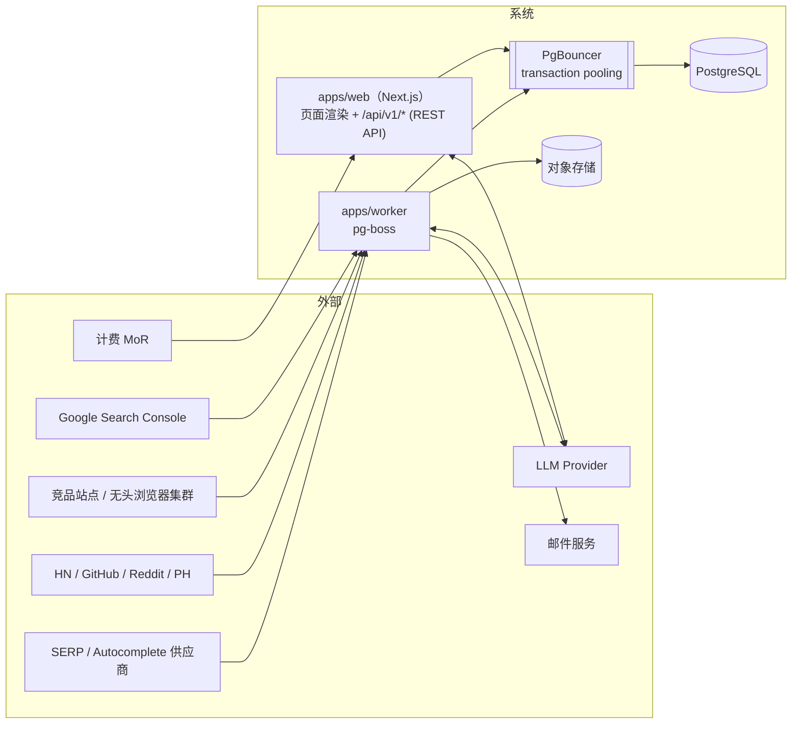

# 02 — 系统架构

Status: Draft ｜ 依赖：01-PRD、00-INDEX

## 1. 目标与约束

| 类别 | 内容 |
|------|------|
| 团队 | 2–3 名工程师；运维面必须小 |
| 核心约束 | 评分可重算（P7）；快照与账本不可变（P5）；单源故障不阻塞全局 |
| 关键取舍 | 模块化单体 > 微服务；Postgres > 多存储；批处理 > 流处理 |
| 首发规模假设 | 见 §11 |

## 2. 总览

> **拓扑说明（ADR-011）**：`apps/web`（Next.js App Router）承载用户界面渲染，也通过 `app/api/v1/*` Route Handler 直接对外提供 REST 端点；两者在同一进程内共享 `packages/services`，不经内部 HTTP 跳步。不再单列独立部署的 `apps/api` 服务。`apps/worker` 独立部署，承担批处理管线、告警投递、GSC 同步、机会报告生成等不应阻塞请求-响应周期的工作。



## 3. 组件职责

| 组件 | 职责 | 不做什么 |
|------|------|----------|
| `apps/web` | 用户界面渲染（RSC/Server Actions 直接调用 `packages/services`）；`app/api/v1/*` 提供 REST（10）端点；鉴权、配额、限流；公开站 SSR / ISR、i18n | 不做批处理、不做定时任务；不直接持有 collector / LLM 长任务（超时敏感操作转发至 worker 队列并轮询） |
| 应用服务层 `packages/services` | `OpportunityService` `DecisionService` `ReportService` `ProjectService` `AlertService` `EntitlementService` | 不含协议细节（HTTP 差异在 adapter 内处理，不渗入 service） |
| `apps/worker` | 每日管线各阶段、告警投递、GSC 同步、机会报告生成（异步部分）、账本写入（S6，单实例） | 不响应用户同步 HTTP 请求 |
| `@app/scoring` | 纯函数：features → 三轴 / Verdict / 生命周期；核心计算使用定点整数（基点），禁止依赖原生浮点的跨版本 / 跨求和顺序一致性（00 ADR-004） | 无 IO、无时钟、无随机数、无 LLM |
| PgBouncer | 连接池代理（transaction 模式），隔离 worker 批处理的高并发短事务与 web 在线查询 | 不做查询路由 / 读写分离决策（首发单主库） |
| PostgreSQL | 事实源、账本、队列（pg-boss） | — |
| 对象存储 | 原始 HTML / JSON 载荷，压缩存储 | 不作为查询源 |

## 4. 代码库结构

```text
apps/
  web/            Next.js（应用 + 公开站 + /api/v1/* Route Handler：REST 出口）
  worker/         pg-boss workers 与调度（含 S6 账本单写入者）
packages/
  core/           领域类型、枚举（来自 00 §4.3）、错误、branded ID 类型（区分 uuid 存储表与 text ULID 表，见 03 §1）
  scoring/        纯函数评分与 Verdict（05）；定点整数运算工具
  ledger/         哈希链、checkpoint、验证（06）
  collectors/     各数据源采集器（04 的契约），含两级抓取（静态 / 无头浏览器）调度
  commercial/     商业信号检测、抽取、摘要装配（07）；M 轴分档纯函数位于 scoring/
  llm/            prompt 注册、schema 校验、引用校验（08）；硬数字占位符渲染
  report/         机会分析报告组装与校验、多格式导出（09）
  services/       应用服务层（`apps/web` 与 `apps/worker` 共同依赖）
  db/             迁移、查询、类型、PgBouncer 连接配置、uuid↔前缀字符串编解码
  i18n/           消息目录与本地化生成（14）
  config/         scoring_config schema 与加载
```

依赖方向：`web → services → {scoring, ledger, commercial, brief, llm, db}`；`worker → services`（与 `web` 平级依赖，不经 `web`）；`scoring` 不得依赖任何其他包（除 `core`）。CI 用依赖规则强制。

## 5. 每日批处理管线

所有阶段以 `(obs_date, stage, scope)` 为幂等键；重跑安全，不产生重复快照。

| # | 阶段 | 计划开始 (UTC) | 输入 | 输出 | 确定性 |
|---|------|---------------|------|------|--------|
| S1 | Discovery | 00:00 | 种子、注意力实体 | 新 query、候选 Opportunity | 否 |
| S2 | Collect | 00:30 | 追踪池、层级 | autocomplete / SERP / 注意力 / 商业快照与 Evidence | 否 |
| S3 | Normalize & Classify | 03:30 | 新快照 | 结果类型、域名分类、商业抽取 | 否（LLM，schema 校验） |
| S4 | Feature Build | 04:30 | 快照与 Evidence | `axis_features` | **是** |
| S5 | Score | 05:00 | features + `scoring_config` | 三轴、Verdict、生命周期 | **是** |
| S6 | Ledger Append | 05:30 | S5 输出 | `verdicts` 行 + checkpoint | **是**（单写入者，见下） |
| S7 | Events & Alerts | 05:45 | Verdict 变化、Kill criteria | 通知 | 是（触发判定）/ 否（投递） |
| S8 | Projections | 06:00 | 账本与业务表 | 读模型、public projection、sitemap | 是 |

- **SLA**：S1–S8 于 06:30 UTC 前完成；账本 checkpoint 于 07:00 前公开。
- **屏障规则与快照批次硬冻结（Snapshot Batch Sealing）**：S4 开始前等待 S2/S3 全部完成或到达 04:30 超时。到达超时时，执行原子批次冻结：将当日 `collector_runs` 中仍处于 `RUNNING` 的作业标记为 `FAILED/TIMEOUT`；S4 特征构建查询时，**强制仅读取 `run_id` 属于已终态为 `SUCCEEDED` 或 `PARTIAL` 的快照记录**，严禁读取超时后迟到写入的数据，彻底规避并发脏读并保障回测与重算 100% 确定性（P7）。超时的来源标记为 `failed`，对应特征标 `stale`，覆盖率下降 → 轴分档可能转为 `INSUFFICIENT`，**永远不阻塞管线**。
- **单元隔离**：collector 按 `(source, batch)` 分作业；一个作业失败只影响该源。
- **S6 单写入者约束（ADR-014）**：`verdicts` 表的哈希链要求"同一 `obs_date` 内按 `opportunity_id` 升序前后依赖"，因此 S6 **只能由一个 Worker 实例执行**，禁止多实例并发写入该表。实现：S5 输出全部落入 `verdicts_pending` 暂存表（无哈希链约束，可并发写）；S6 由单一进程读取当日全部暂存行，按 `opportunity_id` 排序后在内存中串行计算 `row_hash` 与 Merkle 根，最后单次批量 `COPY` 写入 `verdicts` 并清空暂存表。追踪池规模（≤ 2,000 机会）下，此串行内存计算 + 批量提交预期在数百毫秒至数秒内完成，不构成管线瓶颈；若追踪池规模显著增长（见 04 §11），需重新评估是否引入分桶两级 Merkle 结构。
  调度层通过 pg-boss 的单例作业（同一 `obs_date` 的 S6 任务加咨询锁 `pg_advisory_lock`）保证同一时刻至多一个 S6 实例在跑，重复调度直接跳过。

## 6. 确定性边界

```text
   非确定区（可含 LLM / 网络）        │        确定区（纯函数 + 版本化配置）
 采集 → 解析 → 分类/抽取 → 落库快照   │  features → 三轴 → Verdict → 生命周期 → 账本
                                       ▲
                        边界：不可变快照 + scoring_config_version
```

- 边界以内：同输入必同输出（bit-for-bit）；CI 中有 golden 测试（18）。
- 边界之外产生的一切（包括 LLM 分类结果）在落库后即视为**观测事实**，其 `run_id` 与 `prompt_version` 可追溯，但不会在重算时重新调用。

## 7. Discovery（发现管线）

```text
种子来源
  ├─ 主题词表（按 market 维护）
  ├─ 注意力实体（HN / GitHub / Reddit / PH 新实体）
  └─ 修饰词模板（for / vs / free / online / generator / converter / calculator / template …）
        ↓
Autocomplete 扩展（深度 ≤ 2，日预算内）
        ↓
Query 注册（去重键：normalized text + market + language）
        ↓
聚类（SERP Top10 URL 重叠 ≥ 3 → 同簇；无 SERP 时以词面相似度暂挂）
        ↓
候选筛选（CANDIDATE）
   规则：簇规模 ≥ 8；基线期后新增 query ≥ 3（14 天）；非品牌导航词
        ↓
升级为 TRACKED（分配 tier A/B），或长期无信号则 ARCHIVED
```

- **冷启动基线**：任一种子被首次观测后的前 14 天视为基线期，其间的 `first_observed` 不计入"新增 query"指标。
- 聚类以 SERP 重叠为主，语言无关，为 Phase 2 引入 zh-CN 研究语言留出空间。
- 品牌导航词判定：Top1 为实体官方站且 Top10 中超过半数结果均以该实体为主题。

## 8. 应用服务层

所有入口（REST、Worker、Admin）调用同一组服务：

| 服务 | 关键方法 |
|------|----------|
| `OpportunityService` | `search` `get` `compare` `history` |
| `DecisionService` | `watch` `unwatch` `decide` `listWatchlist` |
| `ReportService` | `request` `get` `export` |
| `ProjectService` | `create` `connectGsc` `metrics` |
| `AlertService` | `evaluate` `dispatch` `digest` |
| `EntitlementService` | `check(user, feature, units)` `consume` — 所有入口共用（13） |

## 9. 读模型与缓存
- `opportunity_cards`（物化表）：S8 阶段**双缓冲刷新**，避免长事务锁表影响在线 Feed 查询（ADR-012）：
  1. S8 将当日全量卡片写入影子表 `opportunity_cards_next`（与线上表结构一致，无索引依赖冲突）；
  2. 写入完成并通过完整性检查（行数、必填字段非空）后，在一个短事务内执行 `ALTER TABLE opportunity_cards RENAME TO opportunity_cards_prev; ALTER TABLE opportunity_cards_next RENAME TO opportunity_cards`（原子切换，毫秒级，不持有长锁）；
  3. `opportunity_cards_prev` 保留至下次刷新前，供当次切换出问题时手动回滚。
  Feed 查询任何时刻只读到完整的一份数据，不会看到"正在刷新中"的部分行。
- Detail 由 `verdicts` 最新行 + 快照聚合，结果按 `(opportunity_id, obs_date, locale)` 缓存于 Postgres 表与 HTTP 缓存头。
- 首发不引入 Redis。限流使用 Postgres 计数（令牌桶实现在 `EntitlementService` 内）；若压测不达标再引入。
- 搜索：Postgres FTS + `pg_trgm`。

## 10. 存储与保留

| 数据 | 存储 | 保留 |
|------|------|------|
| 快照（标准化行）、Evidence、Verdict、账本 | Postgres | 永久 |
| 原始载荷（HTML / JSON） | 对象存储（gzip） | 12 个月；账本涉及的载荷永久 |
| `autocomplete_observations` / `serp_results` | Postgres 按月分区（由 `pg_partman` 自动预建未来 2 个月子分区） | 永久；冷分区可归档为只读 |
| LLM 运行记录 | Postgres | 18 个月 |
| 用户 GSC 令牌 | Postgres（信封加密） | 至用户撤销 / 删除 |

## 11. 容量假设（首发，参数化）
| 参数 | 初始值 | 说明 |
|------|--------|------|
| Tier A query | 500–2,000 | 每日 SERP Top10 |
| Tier B query | 5,000–10,000 | 每周 SERP |
| Tier C（仅 autocomplete） | 50,000 | 每日 |
| 商业目标域名 | 2,000–5,000 | 每周爬取 |

- SERP 结果行日增量约 3–4 万，年 ≈ 1,200 万行，Postgres 分区可承载。
- 实际规模由成本模型（04 §6）在 Gate 0 反推确定。

## 12. 环境与部署
- 环境：`dev` / `staging` / `prod`；staging 使用录制回放的供应商响应，不消耗真实配额。
- **连接池（ADR-012）**：生产环境采用分流连接策略：
  1. `apps/web` 与 `apps/worker` 的普通业务查询统一经由 `DATABASE_URL` 连接 PgBouncer（transaction pooling 模式），并为在线查询与批处理分别配置独立的连接池上限，避免批处理占满连接数导致在线请求排队；
  2. `apps/worker` 内部的 `pg-boss` 队列实例与会话级锁（如 S6 单写入者的 `pg_advisory_lock`）统一通过独立环境变量 `DATABASE_DIRECT_URL` 直连 PostgreSQL（或经 PgBouncer 的 session pooling 模式子池），彻底避免 Transaction Pooling 切断 `LISTEN / NOTIFY` 导致任务调度死锁。
- 数据库迁移前向兼容（expand → migrate → contract）。
- 特性开关：配置表 + 环境变量，首发不引入第三方开关服务。

## 13. 失败模式与降级

| 场景 | 行为 |
|------|------|
| SERP 供应商不可用 | 该批 SERP 标 `failed`；W 轴对应机会转 `INSUFFICIENT`；触发 Admin 告警；不阻塞其他阶段 |
| LLM 不可用 | 分类队列积压；新结果类型为 `UNCLASSIFIED`，按规则兜底（不参与"弱结果"加分）；机会报告生成返回 `QUEUED` |
| 商业爬取失败 | 沿用最近快照，Evidence 新鲜度衰减；连续失败 ≥ 3 次的域名降级 |
| 预算触顶 | 自动降级：B 层降为双周 → 暂停 Discovery 扩展 → 暂停新 Tier A 升级（04 §6） |
| 评分作业失败 | 当日不写账本、不发告警，告警值班；次日补跑，账本对缺失日期显式记录 `MISSING` |
