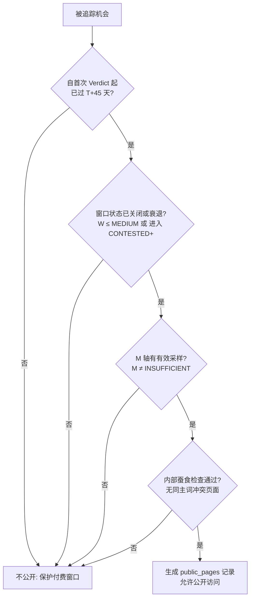

# 15 — 公开获客层与发布流水线规格（Public Site & Publication Spec）

Status: Draft ｜ 依赖：01 §7、03 §15、06 §11、14 ｜ 被依赖：16、19

## 1. 目的与原则

公开获客层（Public Projection Layer）是系统的自然增长与信任建立基石。SEO（搜索引擎优化）与 GEO（生成式 AI 引擎优化）不是外围营销项目，而是产品系统架构的原生组成部分。

**核心原则（01 §7.1）**：
1. **公开 = 延迟 + 有结果**：实时、高价值的未关闭窗口属于付费 Pro 用户的核心权益；公开层仅发布已发生的事实、演进历程与最终战绩，绝不提前泄露实时窗口价值。
2. **纯投影架构（Projection-only）**：公开页面绝不直接跨库读取受限业务表，而是由每日批处理流水线（S8）计算出的 `public_pages` 及公开投影物化视图生成，物理隔离内部数据。
3. **真实数据呈现**：公开站（包括 Landing 页与战绩页）严禁使用抽象概念插画或模拟数据，必须使用真实产品界面与不可篡改的账本统计。账本还不能同时列出命中和失误时，Landing 不写预测准确率、不写未登记的查询体量、不写「Merkle 证明了判断正确」。允许写的是观测起始日、已追踪查询数、研究市场，以及指向 `/methodology` 与 `/track-record` 的链接。
4. **质量门槛与防降权护栏**：Programmatic SEO 必须遵守严密的质量检查；不满足内容丰富度与独特性的页面强制输出 `noindex`，严禁产生低质薄内容。

---

## 2. 公开页面范围与路由

| 路由路径 | 页面类型 | 渲染策略 | 数据源 | 核心转化目标 |
|----------|----------|----------|--------|--------------|
| `/` | 官网首页（Landing） | ISR（24h） | 平台聚合统计 + 真实账本片段 | 注册 / 预售转化 |
| `/pricing` | 价格与套餐 | 静态（SSG） | `13-BILLING-RBAC` 配置快照 | Checkout 结账 |
| `/methodology` | 方法论与证据规范 | 静态（SSG） | 00、05、06、07 规范公开摘要 | 建立专业信任 |
| `/data-sources` | 数据源登记与合规 | 静态（SSG） | 04 登记表脱敏公开视图 | 消除合规疑虑 |
| `/track-record` | 预测战绩公开大盘 | ISR（每日 S8 刷新） | `public.track_record_summary` + Episodes | 证明预测能力，驱动 Pro 转化 |
| `/opportunities/[slug]` | 延迟机会公开页 | ISR / 按需生成 | `public_pages` (page_type='OPPORTUNITY') | 免费体验 → 注册解锁实时 Feed |
| `/markets/[slug]` | 细分市场热度聚合页 | ISR（每周） | `public_pages` (page_type='MARKET') | 广谱长尾搜索获客 |
| `/compare/[slug]` | 精选过期对比页 | ISR（按需） | `public_pages` (page_type='COMPARE') | 比较意图搜索获客 |

---

## 3. 延迟机会发布资格规则（Publication Eligibility）

一个 Opportunity 必须**同时满足以下全部条件**，S8 批处理流水线才允许为其生成公开投影并推入发布队列：



1. **时间延迟门槛**：`obs_date(当前) - first_verdict_date ≥ free_delay_days`（默认 45 天）；
2. **窗口关闭条件**：
   - 当前 W 轴分档已降为 `≤ MEDIUM`；或
   - 机会生命周期已处于 `CONTESTED`、`MATURE` 或 `DEAD` 状态（即市场已充分竞争或消退，不再具备独家窗口先发优势）；
3. **证据充足性**：商业信号 M 轴不得为 `INSUFFICIENT`；必须具备确凿的定价或商业意图记录；
4. **蚕食防护（Cannibalization Check）**：该机会的核心 Query 与现有已收录公开页的相似度不得过高（Jaccard Top10 重叠度 `< 0.7`），避免自身网站在 Google 中产生关键词冲突。

### 3.1 已公开机会的重新演进与保活策略（Re-opened Opportunities Preservation）
根据 05 §6 生命周期定义，处于 `DEAD` 或 `CONTESTED` 的机会未来可能因行业爆发再次重新转入 `FORMING` 或 `EARLY_WINDOW`：
1. **绝对禁止删除页面或返回 404**：直接下线或 404 会严重破坏 Google 已建立的索引权重与反向链接；
2. **页面维持 200 OK 并挂载转化横幅**：页面维持 `status = 'PUBLISHED'`，但顶部注入动态高亮横幅：
   > “⚡ 市场演进提醒：该搜索市场已于 {日期} 重新进入新一轮高价值窗口（最新状态：{verdict}）。当前公开内容为历史归档；最新实时动量、SERP 战情与 AI 开工执行包仅限 Pro 会员专享 [立即升级解锁实时情报]”；
3. **转化价值最大化**：将重新活跃的历史机会天然转化为公开站最强有力的“真实战绩背书与付费漏斗入口”。

---

## 4. 发布流水线（Publication Pipeline）

每日批处理 S8 阶段按照以下 7 步标准工序执行：

```text
S6 账本更新完成
  │
  ▼ 1. 投影提取（Public Projection）：提取满足条件的数据投影，脱敏用户数据
  │
  ▼ 2. 资格断言（Eligibility Rules）：运行 §3 的四道门槛过滤
  │
  ▼ 3. 本地化渲染（Localized Render）：基于 14 规则生成 en-US 与 zh-CN 页面内容
  │
  ▼ 4. 质量审查（Quality Gate）：运行 §5 自动化质检（字数、引用、结构完整性）
  │
  ▼ 5. 索引决策（Indexability Decision）：通过质检标 indexable=true，未通过标 false
  │
  ▼ 6. 静态持久化（Persistence）：写入 public_pages 表并触发 Next.js revalidateTag()
  │
  ▼ 7. 站点地图与内链更新（Sitemap & Graph）：增量更新 sitemap.xml，重新计算主题内链
```

---

## 5. 质量审查门槛（Quality Gate）与索引策略

为防止生成大量低质长尾页面遭受 Google Helpful Content 算法打击，每个拟公开页面必须通过自动质检评级：

| 检查项 | 指标与通过线 | 未通过处置 |
|--------|--------------|------------|
| **正文有效字数** | 正文纯文本 ≥ 600 词（英文）/ 800 字（中文） | `indexable = false` |
| **证据事实密度** | 页面内有效可追溯的 `evidence_id` 引用数 ≥ 3 条 | `indexable = false` |
| **商业证明完备性** | “证明了什么 / 未证明什么”两栏均非空且有具体事实支撑 | `indexable = false`（阻断发布） |
| **SERP 弱度具体性** | 列出 ≥ 1 个具体弱竞争对手 URL 与弱度理由 | `indexable = false` |
| **模板文本率** | 非模板动态内容占比 ≥ 40% | `indexable = false` |

### 5.1 索引控制机制
* **通过质检**（`indexable = true`）：
  - 允许被搜索引擎抓取并收录：`<meta name="robots" content="index, follow">`；
  - 自动注入对应语言的 `sitemap.xml`。
* **未通过质检**（`indexable = false`）：
  - 页面物理存在（用户仍可通过直接链接访问），但输出：`<meta name="robots" content="noindex, follow">`；
  - 不纳入 `sitemap.xml`，防止稀释整站 SEO 权重。

---

## 6. SEO & GEO 结构化数据规格

所有公开页必须在 Next.js 服务端渲染输出标准的 JSON-LD 结构化数据，确保传统搜索引擎与 AI 检索代理（Perplexity、SearchGPT、Google AI Overviews）能够精确抽取事实。

### 6.1 战绩页（`/track-record`）
注入 `Dataset` 结构，声明预测账本的开源性与不可篡改时间戳：
```json
{
  "@context": "https://schema.org",
  "@type": "Dataset",
  "name": "Emeradar Search Opportunity Prediction Ledger",
  "description": "Append-only prediction ledger tracking search market formation with cryptographic Merkle checkpoints.",
  "license": "https://emeradar.com/methodology",
  "temporalCoverage": "2026-09-01/..",
  "spatialCoverage": "US",
  "variableMeasured": ["Demand Formation", "Entry Window", "Market Formation Outcome"]
}
```

### 6.2 延迟机会详情页（`/opportunities/[slug]`）
注入 `Article` 与 `ItemPage` 复合结构：
```json
{
  "@context": "https://schema.org",
  "@type": "TechArticle",
  "headline": "Search Market Analysis: {title_original}",
  "datePublished": "{first_observed_at}",
  "dateModified": "{obs_date}",
  "author": { "@type": "Organization", "name": "Emeradar Intelligence Engine" },
  "about": {
    "@type": "Thing",
    "name": "{primary_query_text}"
  }
}
```

---

## 7. 站点地图与内链拓扑（Hub-and-Spoke）

1. **分级 Sitemap**：
   - `/sitemap.xml`：索引总表；
   - `/sitemap-core.xml`：主站静态营销页（Landing、Pricing、Methodology 等）；
   - `/sitemap-opportunities-{yyyy-mm}.xml`：按月切分的延迟机会归档地图（仅包含 `indexable = true` 的页面）；
   - `/sitemap-markets.xml`：市场主题聚合页。
2. **主题内链架构（Hub and Spoke）**：
   - 每个市场主题页（Hub，如 `/markets/developer-tools`）自动聚合该主题下全部已公开的延迟机会（Spokes）；
   - 处于同一聚类（Cluster）内的机会页面之间互相呈现相关比较链接，形成网状互链；
   - 每个延迟机会页面底部固定引导链接：“查看该机会最新的预测账本验证记录（Track Record）”。

---

## 8. 监控与反作弊指标

| 指标 | 目标线 | 预警线 | 处置措施 |
|------|--------|--------|----------|
| **GSC 索引率（Index Coverage）** | `indexable` 页面索引率 ≥ 80% | < 60% | 调高质检门槛，暂停新页面索引提交，全面排查薄内容 |
| **软 404 / 抓取异常率** | < 0.5% | > 2% | 触发 P1 运维告警，检查 Next.js ISR 路由异常 |
| **爬虫抓取预算消耗（Crawl Budget）** | Googlebot 日常正常抓取 | 突发 > 10× 异常抓取 | 检查是否存在死循环内链，开启边缘 CDN 频率限制 |
| **付费价值泄露率** | 0 容忍（未过 45 天或实时窗口严禁泄漏） | > 0 | **P0 事故**：立即下线公开投影流水线并全量清除 CDN 缓存 |
