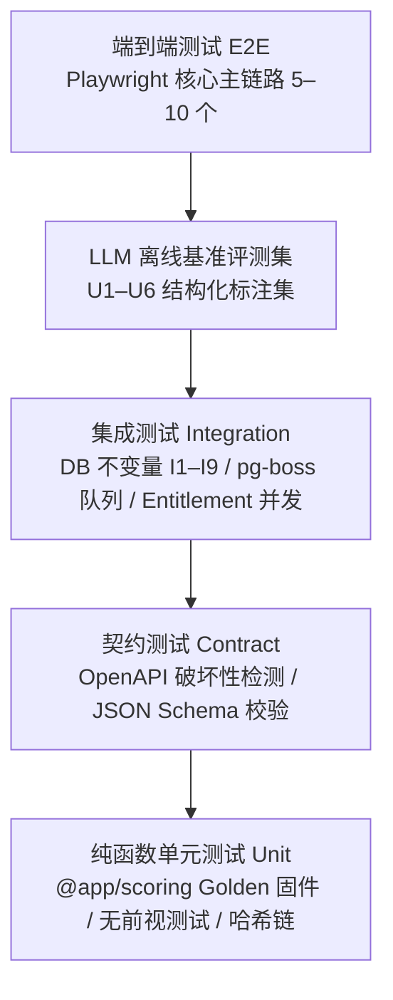
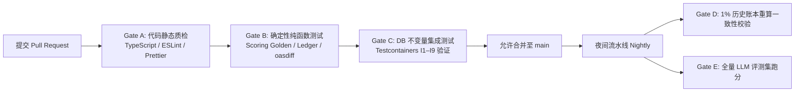

# 18 — 测试策略与质量工程规格（QA & Test Strategy）

Status: Draft ｜ 依赖：01 §3 & §10、05 §10、06 §5、08 §10、09 §7 ｜ 被依赖：19

## 1. 目的与原则

本系统以“**不可篡改的预测战绩与可审计的证据链**”为核心信誉资产。任何评分不确定性、哈希链断裂、LLM 幻觉或数据泄露都将直接摧毁产品立足之本。

**核心原则**：
1. **确定性第一**：评分纯函数（`@app/scoring`）与账本哈希链（`@app/ledger`）实行 100% 严苛的 Golden 测试，杜绝跨架构、跨版本的浮点与时间漂移；
2. **LLM 结果必须经过确定性严查**：大模型生成的内容必须通过编译期般的自动化断言（Schema、硬数字占位符保真度、证据引用有向图），评测集纳入常规 CI；
3. **数据库不变量自动断言**：DDL 中的 I1 至 I9 不变量必须在 CI 集成测试中执行主动攻击测试；
4. **测试分层与轻量敏捷**：2–3 人团队不维护冗杂低效的低质用例，重点构建高价值契约测试与金字塔分层保障。

---

## 2. 测试分层金字塔（Test Pyramid）

---

## 3. 单元测试（Unit Testing）

### 3.1 `@app/scoring` 确定性评分测试（05 §10）
* **Golden 测试固件（Fixtures）**：
  * 在 `packages/scoring/test/fixtures/` 维护包含典型行业机会输入与上一日状态的快照集；
  * 断言：同一 `ScoringInput` 无论在 ARM64（开发机）还是 x86_64（CI 容器），生成的 `ScoringOutput`（三轴分档、Verdict、`explanation`）必须 **bit-for-bit 完全一致**；
* **边界与极端值**：
  * 阈值边界测试（Score = 74.99 vs 75.00，验证无浮点舍入跳档）；
  * 极端数据：宇宙规模 `< min_universe_size` 时 D 轴必须正确归为 `INSUFFICIENT` 并附带 `PARTIAL_DATA`；
* **严格无前视断言（No-Lookahead Test）**：
  * 向特征构建器注入 `observed_at > obs_date 23:59:59Z` 的未来快照数据，断言输出的分数与 Verdict 绝对不发生任何变化。

### 3.2 `@app/ledger` 哈希链与 Checkpoint（06 §4）
* **RFC 8785 JCS 规范化测试**：验证 JSON 键排序、浮点表示在极端字段下的哈希稳定性；
* **RFC 6962 Merkle 树断言**：测试奇数叶子节点、空节点与跨天串联的前后依赖一致性。

### 3.3 Query 规范化（14 §3）
* 运行 100+ 边界词测试集（含重音、多空格、全角符号、C++、.NET 等保护词），验证 `text_normalized` 的确定性。

---

## 4. 集成测试（Integration Testing）

采用 Testcontainers 或独立 PostgreSQL 测试容器，重点验证系统不变量与并发安全性：

| 测试用例模块 | 攻击场景与测试动作 | 预期断言 |
|--------------|--------------------|----------|
| **不变量 I1** | 应用角色执行 `DELETE FROM verdicts` 或 `UPDATE evidence` | 数据库触发器直接抛出 SQL 异常，操作被强行回滚 |
| **不变量 I2** | 尝试针对同一 `(opportunity_id, obs_date)` 插入两条 `is_override = false` 的行 | 命中唯一部分索引，抛出唯一键冲突 |
| **不变量 I8** | 创建机会时未关联 `role = 'PRIMARY'` 的查询，或尝试关联两条 PRIMARY 查询 | 事务中断或抛出排他唯一索引错误 |
| **配额并发预占** | 10 个并发线程同时发起 `EntitlementService.reserve()`，此时配额仅剩 1 | **恰好 1 个线程成功**，其余 9 个立即返回 `QUOTA_EXCEEDED`，`used` 计数器最终严格等于上限，绝无超卖 |
| **两级爬取降级** | 模拟 SPA 壳页面返回空文本，触发 Tier 2 检测 | 确认 `fetch_tier` 被标记为 `HEADLESS`，并正确调用无头浏览器驱动 |
| **S6 咨询锁互斥** | 两个 Worker 实例同时对同一 `obs_date` 调度 S6 账本归档 | 一个持有 `pg_advisory_lock` 执行批量写入，另一个跳过执行，绝不重复生成行哈希 |

---

## 5. 契约测试（Contract Testing）

* **OpenAPI 兼容性断言**：
  * CI 中从 Zod 领域模型动态生成 `openapi.json`，使用 `oasdiff` 与主分支基线比对；
  * 若存在未经显式批准的破坏性变更（Breaking Change，如删除字段、修改枚举类型），直接阻断 PR 合并；
* **机会报告 Schema 校验**：
  * 校验生成的报告 JSON 是否 100% 符合 `packages/report/schema/report-1.0.json` 规范。

---

## 6. LLM 评测集体系（Evaluation Suites）

评测用例集纳入独立版本化目录 `packages/llm/evals/`，分为快速抽样集（PR 阻断）与全量评测集（夜间执行）：

| 任务 | 评测集规模 | 黄金标准来源 | 核心指标与门槛 | 执行频率 |
|------|------------|--------------|----------------|----------|
| **U1 实体归并** | 300 对同义/近邻候选 | 人工双盲标注 | 自动归并准确率 ≥ 95% | 夜间 |
| **U2 SERP 分类** | 500 个真实 SERP 网页 | 资深 SEO 分析师标注 | `result_type` 宏 F1 ≥ 0.85；`is_specialist` F1 ≥ 0.88 | 夜间 |
| **U3 定价抽取** | 200 个多样化定价页 | 人工提取真实价格表 | 价格数值与套餐名称精确匹配率 ≥ 98% | 每次 Prompt 修改 |
| **U4 解释文本** | 50 条每日 Why Now 样本 | 事实包与生成比对 | 自动占位符解析率 100%；事实一致性 ≥ 95% | PR 抽检 |
| **U5 机会研究报告** | 20 份真实机会报告样本 | 见 §7 评测计分卡（Rubric） | **Rubric 得分 ≥ 7/8 且 R1、R2 零容忍项 100% 达标** | 发布新模型前 |
| **U6 本地化** | 每语言 100 组翻译对 | 双语对比 | 占位符、硬数字与证据引用保真度 100% | PR 抽检 |

---

## 7. 机会研究报告评分体系（Rubric Scorecard，09 §7）

由 2 名独立评审对生成的机会分析报告执行双盲评审打分：

| 维度 | 检查内容 | 分值 | 一票否决？ |
|------|----------|------|------------|
| **R1. 事实引用有效性** | 文中所有事实陈述必须附带合法证据引用，且数字由确定性占位符正确渲染 | 1 分 | **是（未通过总分记 0）** |
| **R2. 零编造（No Hallucination）** | 不存在未经快照佐证的凭空捏造竞品、虚构价格或虚假市场结论 | 1 分 | **是（未通过总分记 0）** |
| **R3. 占位符渲染完整性** | 报告最终渲染文本中绝不残留未解析的 `{{Fx.field}}` 占位符 | 1 分 | 否 |
| **R4. SERP 弱点客观性** | 竞品与弱对手分析明确对应到 Top10 快照中的弱结果 URL | 1 分 | 否 |
| **R5. 变现建议诚实度** | 变现路径严格受 M 轴证据强度约束，未经验证必须明确标明 | 1 分 | 否 |
| **R6. 推荐形态合理性** | 出货形态符合搜索意图矩阵（高交互做 Tool，聚合做 Directory/PSEO） | 1 分 | 否 |
| **R7. 止损红线明确度** | 必须包含至少 1 条可落地的 Kill Criteria 条件 | 1 分 | 否 |
| **R8. 时效与免责声明** | 明确标注观测基准日，附带标准免责声明 | 1 分 | 否 |

---

## 8. 端到端自动化测试（E2E Testing）

基于 Playwright 编写 3 条核心用户黄金链路（运行于 Staging 回放环境，不消耗生产预算）：
1. **Onboarding → Feed 决策流**：新用户完成 4 问偏好问卷 → 浏览 Feed → 筛选 S 级周末工具 → 打开 Detail → 展开证据抽屉查看证据 → 点击 `GO` 并输入理由；
2. **机会报告导出 → Project 立项流**：针对 GO 状态机会触发生成 → 验证报告 6 大分析板块正常渲染 → 一键导出 Markdown / PDF → 点击“基于此机会立项”成功创建 Project；
3. **公开站 SEO 渲染流**：访问 `/track-record` 验证 Merkle Checkpoint 展开组件正常 → 访问延迟机会页验证 `noindex` / `indexable` 标签符合预期。

---

## 9. 持续交付流水线质量门禁（Quality Gates）

* **夜间账本全链自检任务（06 §5）**：
  * 从首日 Checkpoint 起，重现近 60 天全部 Verdict 的行哈希与 Merkle 根；
  * 若发现任何一行哈希不匹配，立即挂起夜间流水线并触发 P0 告警，定位快照污染来源。
