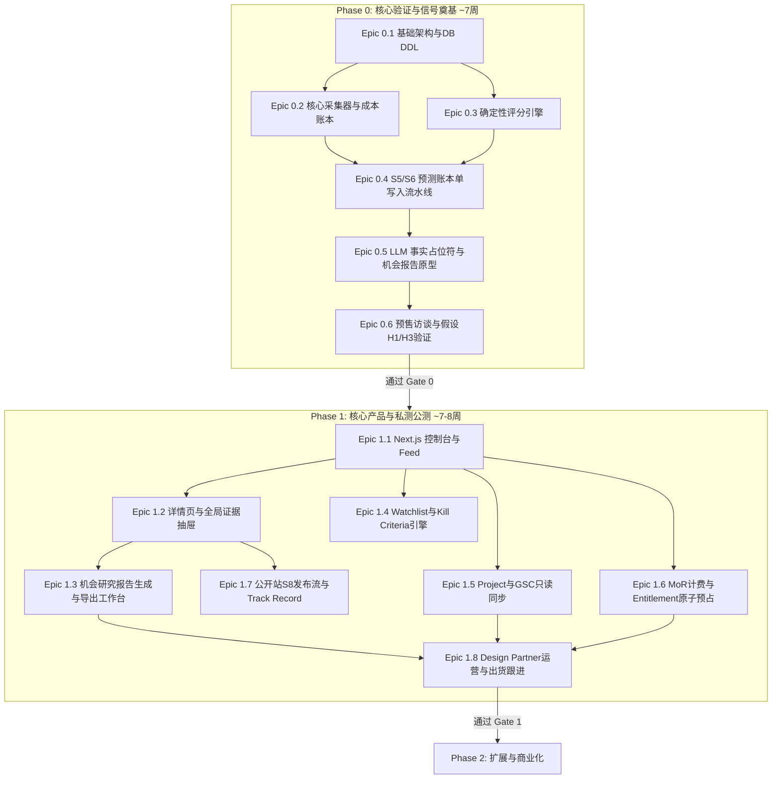

# 19 — 交付计划与里程碑规格（Delivery Plan & Milestones）

Status: Draft ｜ 依赖：00-INDEX、01 §10、02、17、18 ｜ 被依赖：全员

## 1. 团队假设与资源约束

* **团队规模**：2–3 名全栈工程师（熟悉 TypeScript、Next.js、PostgreSQL 与 LLM 编排）；
* **运维策略**：最小化运维面，严禁为了局部优化过早引入 Redis、Kafka 或微服务拆分；
* **硬性工期约束**：阶段周期严格按当前人员带宽设定，**严禁靠堆砌范围或赶工削减测试与合规环节**。任一阶段未通过 Gate，先修假设与核心质量，不盲目进入下一阶段（01 §3.2）。

---

## 2. 总体里程碑与依赖图谱



---

## 3. Phase 0 验证与信号奠基（第 1–7 周）

**目标**：跑通每日自动化采集批处理管线，上线不可篡改的预测账本（F1, F2），验证可证伪假设 H1（信号有预测力）与 H3（出海开发者愿意为决策付费），实测锁定供应商单位经济成本。

| Epic 编号 | 模块内容 | 关键产出与验收标准 | 负责人 |
|-----------|----------|--------------------|--------|
| **Epic 0.1** | 单仓工程与数据库 DDL | pnpm + Turborepo 搭建；PostgreSQL 15+ 迁移脚手架；`uuid`（UUIDv7）混用主键、月度 Range 分区表、PgBouncer 分流连接配置；DB 不变量 I1–I9 单元测试通过 | 后端 |
| **Epic 0.2** | 采集器与成本账本 | `src_ac`（分层早停剪枝）、`src_serp` 授权 API、`src_crawl`（静态优先 + 托管无头浏览器回退）采集器；每次采集原子写入 `cost_ledger`；预算护栏生效 | 后端/数据 |
| **Epic 0.3** | 确定性评分引擎 | `@app/scoring` 纯函数包；三轴与 Verdict 计算；定点基点整数运算（杜绝原生浮点漂移）；Golden 固件测试覆盖边界与去抖规则 | 后端/数据 |
| **Epic 0.4** | 批处理管线与账本归档 | S1–S8 串行调度器；`verdicts_pending` 暂存与 S6 单 Worker 内存串行哈希链、Merkle Checkpoint 批量提交（ADR-014）；夜间重算自检任务 | 后端 |
| **Epic 0.5** | LLM 管道基座与报告评测 | Prompt 注册表；U1–U3 分类抽取；U4/U5 硬数字占位符归一化解析器（08 §6.3）；人工评测集打磨，内部产出 20 份机会报告样本 | 后端/ML |
| **Epic 0.6** | 预售访谈与冷启动积累 | 开展 ≥ 20 场华语出海开发者深度访谈；账本连续运行累积首批 T+30 数据，产出首份评估报告验证假设 H1 | 全员 |

### Gate 0 交付门槛（进入 Phase 1 的红线）
1. **H1 假设验证过线**：Top-decile 机会的 30/60 天市场形成事件率 $\ge$ 基线 3×，证明早期信号确实具备预测力；
2. **单位经济成本闭环**：基于真实供应商报价与 Autocomplete 早停实测数据，单机会月成本在预期定价下可支撑 $\ge 70\%$ 毛利率；
3. **商业意向验证（H3）**：$\ge 8$ 名开发者完成预售预付或签署意向定金协议；
4. **机会报告质量达标**：内部 20 份机会报告样本按 8 分制 Rubric 盲审通过率 $\ge 80\%$，且事实引用与零编造项（R1, R2）100% 达标；
5. **数据源合规登记**：全部引入源完成 04 §7 准入合规登记。

---

## 4. Phase 1 核心产品闭环与私测/公测（第 8–15 周）

**目标**：交付高可用 Web 控制台、深度机会分析报告导出、公开战绩页、MoR 订阅计费与告警投递；面向 10–30 个 Design Partner 跑通出货全闭环。

| Epic 编号 | 模块内容 | 关键产出与验收标准 | 负责人 |
|-----------|----------|--------------------|--------|
| **Epic 1.1** | Next.js 工作台与 Feed 呈现 | App Router 架构搭建；极简 Onboarding 4 问拦截弹窗；虚拟长列表 Feed；Tab 切换与多维筛选；保底回退提示渲染 | 前端 |
| **Epic 1.2** | 机会工作台与证据抽屉 | Detail 页面 9 大决策板块按序展开；SERP 弱度具体展示；商业证据“证明/未证明”双栏面板；全局滑动证据抽屉（Zustand） | 前端 |
| **Epic 1.3** | 机会研究报告生成与导出工作台 | 结构化 6 大板块展示；MD/JSON/PDF 多格式导出；基于此机会立项闭环；Entitlement 配额 Hold&Release 联动 | 前后端 |
| **Epic 1.4** | 告警规则与 Kill Criteria | 闭环枚举 DSL 评估引擎；一键采纳系统 Kill criteria；Email 与通用 Webhook（含 Slack/Discord 包装）投递与频控 | 后端 |
| **Epic 1.5** | 出货管理与 GSC 结果回流 | 域名轻量可用性探测快速点亮 `LAUNCHED`；Google OAuth 授权集成；周调度拉取曝光/点击并绘制趋势图 | 全栈 |
| **Epic 1.6** | MoR 计费与原子配额引擎 | 集成 MoR 托管结账与 Webhook；`EntitlementService` 实现入队原子预占（`reserve`）与彻底失败补偿（`refund`）；配额耗尽引导 UX | 全栈 |
| **Epic 1.7** | 公开站发布流与 Track Record | S8 公开投影计算；延迟资格规则（T+45d & W降档）；`/track-record` 战绩大盘渲染与 Merkle 根校验入口；自动 Sitemap | 全栈 |
| **Epic 1.8** | 伙伴验证与立项闭环跟踪 | 引入 10–30 个出海 Design Partner；端到端跟踪 GO → 导出报告 → 实际立项出货；每周收集产品反馈与 Rubric 抽检 | 全员 |

### Gate 1 交付门槛（公开发布 Release 1.0 的红线）
1. **战绩账本真实公开**：预测账本在生产环境连续运行 $\ge 60$ 天，战绩页完整公开历史预测的命中与失误名单，拒绝任何事后粉饰；
2. **出货转化率达标（H4）**：在 Design Partner 样本中，点击 GO 的机会在 30 天内上线出货率 $\ge 30\%$；
3. **真实付费转化**：沉淀 $\ge 10$ 名稳定付费 Pro 订阅用户；
4. **服务质量 SLA**：核心 Feed/Detail p95 响应时间稳定 $< 1.5$ 秒，批处理管线连续 14 天于 06:30 UTC 前准时完成。

---

## 5. Phase 2 & Phase 3 路线图概览

### Phase 2：能力扩展（公测验证通过后，视 Gate 1 达成情况启动）
* **历史回放（Historical Replay）**：用户端支持选择任意历史日期查看当时的全站快照与 Verdict 判定；
* **智能 Copilot 对话助手**：严格限定于平台快照数据的问答，每一句回答必须强制注入平台 `evidence_id`，杜绝通用聊天；
* **拓展中文出海市场**：验证 `zh-CN` 研究语言与相应分词聚类；
* **扩展出货形态**：支持 `API_DEVTOOL` 与 `MANAGED_SERVICE` 对应的机会分析；
* **GSC 真实出货结果自动反哺校准评分阈值**。

### Phase 3：规模化增长（视 Gate 2 达成情况启动）
* **Programmatic SEO 矩阵规模化扩张**；
* **Team 套餐与多坐席团队协作功能**；
* **跨项目的全生命周期投资组合管理建议**。

---

## 6. 关键路径分析与应急预案

```text
关键路径（Critical Path）：
Epic 0.1 (DDL/架构) → Epic 0.2 (采集器) → Epic 0.3 (评分包) → Epic 0.4 (每日账本流水线)
  → Gate 0 验证 → Epic 1.1 (控制台) → Epic 1.3 (机会报告导出) → Gate 1
```

| 突发风险场景 | 触发标志 | 应急处置预案 |
|--------------|----------|--------------|
| **H1 假设不成立（信号无预测力）** | Gate 0 评估命中率低于基线 3× | **不推进 Phase 1**；暂停前端界面开发，组织为期 2 周的专项攻关，调优特征工程（调整 Autocomplete 动量权重，引入新注意力源）；重新回测，直到指标过线 |
| **数据源供应商封禁或单价暴涨** | 连续 2 天采集器不可用或月预算告警 | 立即根据 04 §8 备选矩阵无缝切换至备选供应商（下游 Schema 完全一致）；同时触发 04 §6.2 自动降级（暂停 Discovery 扩展，B 层降为双周频次） |
| **LLM 生成内容出现事实幻觉** | Rubric 抽检 R2 违例（编造竞品/价格） | 立即收紧 08 §6.3 校验器，降低 LLM 自由发挥温度（降至 0.1）；强制核心段落回退至纯规则模板直出，直到修复 |
| **小团队工期落后延误** | 关键路径节点延误 > 1 周 | **严格砍除非核心特性，绝不延后 Gate 质量标准**：优先砍掉 Compare 页面与邮件 Webhook 自定义模板，全力保住“Feed → Detail → 机会报告导出 → Project 立项”核心决策链路 |
