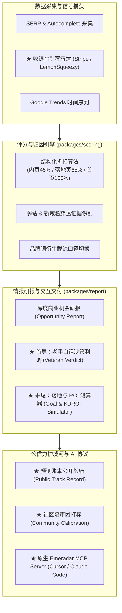

# 23 — 竞品对标演进与实施计划 (Competitive Evolution & Execution Plan)

**文档状态**：Approved for Implementation  
**版本**：1.0.0  
**日期**：2026-10-05  
**对标基准**：`seo.web.cafe`（哥飞的 SEO 工具箱）深度逆向分析  

---

## 1. 背景与核心战略定位

### 1.1 对标洞察与警惕“四不像”
通过对 `seo.web.cafe` 的全面深度研究，我们清晰地看到成熟出海工具站的产品长处：
- 极其贴近实战的**大白话归因**（大站内页折算、弱站占位穿透）；
- 极具说服力的**商业化证据捕获**（Stripe 收银台 `checkout.stripe.com` 引荐流量追踪）；
- 闭环的**投入产出测算**（KGR / EKGR / KDROI 与目标月收入反推）；
- 极度敏捷的**AI 协议卡位**（MCP Server / Claude Skills / CLI）。

但 Emeradar **绝不能盲目抄袭对方的 20+ 个边缘小工具**（如起名、文本长度、AdSense 73 项预检、邮箱提取、红人砍价、模拟经营游戏）。盲目平铺工具页面，会彻底毁掉 Emeradar 严肃、严谨的商业情报定位，沦为一个平庸的“SEO 杂货铺”。

### 1.2 Emeradar 的定位主轴与战略克制
* **定位主轴**：**出海 Builder 的商业机会雷达与预测胜率账本（Intelligence Radar & Prediction Ledger for Builders）**。
* **做与不做边界（Not-to-do List）**：
  1. **坚决不做站长日常杂役工具**：不建独立的起名、查权重、AdSense 体检页面。
  2. **坚决不做无序的任意词单点审计**：入口始终维持“雷达主动发现”与“用户关注池（Watchlist）”。
  3. **坚决不臆造推断 MRR**：严格坚守 4 级商业证据分类，没有观测到的真实收据或支付行为绝不虚标确定性收入。
* **破局哲学**：**把对方优秀的实战逻辑“降维内嵌”进 Emeradar 的核心链条，放大我们“主动雷达 + 预测账本”的高维护城河**。

---

## 2. 总体演进架构与数据流图



---

## 3. 分阶段实施路线图

```
┌────────────────────────────────────────────────────────┐
│ Sprint 1: 研报升维与落地测算内嵌 (Report Cognition & Sim) │
│ - 结构化折扣 KD 与弱站穿透证据链                         │
│ - 研报首屏新增老手白话决策判词 (Veteran Verdict)          │
│ - 研报末尾嵌入交互式目标落地测算器 (Goal & ROI Simulator)  │
└────────────────────────────────────────────────────────┘
                           │
                           ▼
┌────────────────────────────────────────────────────────┐
│ Sprint 2: 收银台商业证据雷达 (Checkout Referral Radar)   │
│ - 新增 Stripe / LemonSqueezy 收银台引荐流量采集器         │
│ - 关联需求簇与真实付费证据，升级为 OBSERVED 级信号        │
└────────────────────────────────────────────────────────┘
                           │
                           ▼
┌────────────────────────────────────────────────────────┐
│ Sprint 3: 预测账本公开战绩与众包校准 (Ledger & Community)│
│ - 建设公开预测战绩大盘 (/ledger: 30d/90d 履约胜率对账)   │
│ - 研报与账本底部集成社区陪审团打标 (🎯精准/偏高/偏低)     │
└────────────────────────────────────────────────────────┘
                           │
                           ▼
┌────────────────────────────────────────────────────────┐
│ Sprint 4: 开发者 AI Native 生态 (MCP Server & CLI)     │
│ - 官方 Streamable HTTP MCP Server 协议落地             │
│ - 抢占 Cursor / Claude Code IDE 开发第一入口           │
└────────────────────────────────────────────────────────┘
```

---

## 4. 详细开发任务与技术规范

### 4.1 Sprint 1：研报升维与落地测算内嵌（当前优先实施）

#### Task 1.1：`packages/scoring` 算法升级
1. **页面强度折扣**：
   - 首页权重：1.0；
   - 专项针对性落地页（标题直接包含核心词）：0.65；
   - 通用大站顺路内页：0.45。
2. **弱站穿透信号**：
   - 若 Top 10 中出现 `age < 18 个月` 或 `DR < 25` 的站点，生成 `weak_site_detected: true` 与 `penetration_advantage` 描述。
3. **品牌词截流口径**：
   - 当识别为品牌词时，剔除不可竞争的前 1~2 个官方占位，评估第三方做 `alternative`、`review` 或 `vs` 截流的竞争度。

#### Task 1.2：`packages/report` 研报数据模型扩展
1. 在 `Section1ExecutiveSummary` 中新增 `veteranVerdict`：
   ```typescript
   export interface VeteranVerdict {
     headline: string; // "大站仅内页覆盖，已有 8 个月新站切入，建议 45 天窗口期内用独立首页正面截流"
     penetrationAngle: 'HOMEPAGE_DIRECT' | 'ALTERNATIVE_INTERCEPT' | 'AGGREGATOR_PAGE';
     structuralReasons: string[]; // ["第3名为8个月新站", "Top10中6席为大站无意内页"]
   }
   ```
2. 新增 `SectionGoalSimulator`：
   ```typescript
   export interface SectionGoalSimulator {
     defaultMonthlyTargetUSD: number; // 默认 2000
     estimatedKd: number;
     requiredDomainsLow: number;      // 所需最少引用域
     requiredDomainsHigh: number;     // 所需常规引用域
     targetDrRange: string;           // "DR 15 ~ 25"
     kgr: number;                     // intitle / searchVolume
     ekgr: number;                    // intitle * (1 + KD/100) / searchVolume
     clickValueUSD: number;           // 默认 0.1
   }
   ```

#### Task 1.3：`apps/web` 研报交互升级
1. 研报顶部渲染 **白话决策判词卡片**，提供清晰、具象的入场角度；
2. 研报末尾渲染 **目标落地与投入产出测算器（Goal & ROI Simulator）**：
   - 支持拖拽滑块自定义月收入目标（如 \$500 ~ \$10,000）；
   - 动态反推：所需月搜索点击量、预期日均 UV、内容/页面规模、外链预算阶梯、KDROI 预期回报率。

---

### 4.2 Sprint 2：收银台商业证据雷达（Checkout Referral Radar）

#### Task 2.1：采集器开发（`packages/collectors`）
1. 创建 `packages/collectors/src/checkout-referrals-collector.ts`；
2. 抓取 `checkout.stripe.com`、`app.lemonsqueezy.com/checkout`、`checkout.paddle.com` 的引荐域名单、月度流量与环比趋势；
3. 输出规整的信号快照（Evidence Snapshot）。

#### Task 2.2：商业信号入库与机会关联
1. 数据库支持存储收银台引荐记录；
2. 雷达扫描到某一赛道时，自动检索关联品类下是否存在高频跳收银台的工具；
3. 将商业信号分级由推测提升为 `OBSERVED`，并在研报中作为核心实证高亮。

---

### 4.3 Sprint 3：预测账本公开战绩与社区校准

#### Task 3.1：公开战绩胜率大盘（`apps/web/src/app/ledger`）
1. 统计并展示历史预测命中率曲线（30天/90天）；
2. 每条预测附带完整时间戳快照、原始证据 Hash 与履约核销状态；
3. 树立行业唯一的透明履约背书。

#### Task 3.2：社区陪审团众包组件（Community Jury）
1. 研报与账本条目底部嵌入打标组件：
   - `🎯 判定精准，已立项开工`
   - `⬆️ 竞争评估偏保守`
   - `⬇️ 需求存疑 / 转化难`
2. 记录投票行为，用于系统自学习与评分配置优化。

---

### 4.4 Sprint 4：开发者 AI Native 生态（MCP Server）

#### Task 4.1：原生 MCP Server 构建（`apps/web/src/app/api/mcp`）
1. 实现符合 Model Context Protocol 规范的 Streamable HTTP 接口；
2. 注册 4 个核心工具：
   - `emeradar_latest_opportunities`
   - `emeradar_inspect_opportunity`
   - `emeradar_query_ledger`
   - `emeradar_simulate_roi`
3. 支持一键导入 Cursor、Claude Code 与 Windsurf。

---

## 5. 验收标准与成功度量

1. **研报决策效率**：用户在不跳转任何外部工具页面的前提下，直接在研报首屏获得白话切入建议，在末尾完成 ROI 与预算试算。
2. **商业信号确定性**：成功监控 Stripe/LemonSqueezy 引荐榜，并在研报中产出具名的真实付费佐证。
3. **公信力与护城河**：预测账本具备公开对账大盘，实现预测生命周期可追溯、可审计。
4. **代码纯粹性**：无任何无用的边缘小工具页面混入，架构完全忠于 PRD §1.2 定义。
